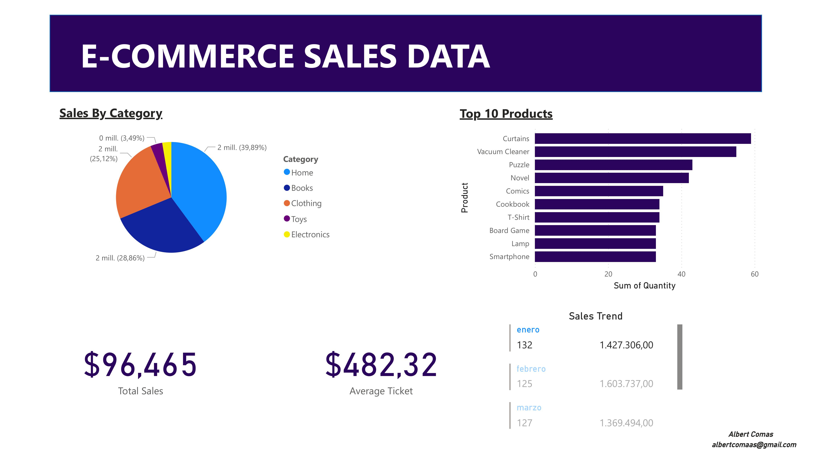

# E-commerce Sales Analysis📊​
This project simulates a sales analysis for a fictional e-commerce business. It was developed as an exercise in exploratory data analysis, data cleaning, and business KPI visualization.

## 📃​ Dataset
E-Commerce Sales Analysis Data​:👇

(./data/ecommerce_sales_data.csv)
## 🧪 Tools used
- Python (Pandas,Numpy)
- PowerBI
- Excel
- Github
  
## 🔍 Analysis Performed
- Data cleaning and date formatting.
- Analysis of total sales, average ticket sales, and sales trends.
- Top 10 best-selling products.
- Total sales by category.
  
## 📈 Featured Views
- Sales pie chart by category.
- Line chart for the top 10 products.
- Row chart to view sales trends.
- KPI chart: total sales and average ticket.

## 📎Dashboard Screenshots

## 🧠 Lessons Learned
- Knowledge and use of Python for data cleansing, organization, and extraction.
- Combined use with Power BI for actionable insights.
- Organization of exploratory analysis and data visualization.
- Best practices for publishing projects on GitHub.
